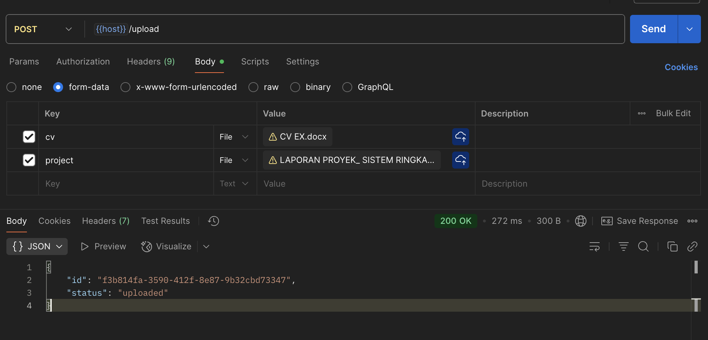

# AI Candidate Evaluation System

This project is an **AI-powered candidate evaluation system** built with Node.js, MySQL, RabbitMQ, ChromaDB, and Google’s Gemini LLM.  
It evaluates job candidates by analyzing their **CV (resume)** and **Project Report**, then generates structured feedback and scoring.

---

## Tech Stack
- **Node.js with Express.js as Router** – Backend service & worker
- **MySQL** – Database for storing jobs & results
- **RabbitMQ** – Message broker for job queueing
- **ChromaDB** – Vector database for storing job descriptions and rubrics
- **Gemini Model** – LLM for CV & project evaluation

---

## Database Setup
Run the following SQL to create the `jobs` table:

```sql
CREATE TABLE jobs (
  id CHAR(36) PRIMARY KEY,
  cv_text LONGTEXT NOT NULL,
  project_text LONGTEXT NOT NULL,
  status ENUM('uploaded','queued','processing','completed','failed') DEFAULT 'uploaded',
  result JSON NULL,             
  created_at TIMESTAMP DEFAULT CURRENT_TIMESTAMP,
  updated_at TIMESTAMP DEFAULT CURRENT_TIMESTAMP ON UPDATE CURRENT_TIMESTAMP
);
```

---

## Environment Configuration
Create a `.env` file in the root directory:

```ini
# Server
SERVER_PORT=3000

# RabbitMQ
RABBITMQ_IP=localhost
RABBITMQ_PORT=5672
RABBITMQ_USERNAME=
RABBITMQ_PASSWORD=
RABBITMQ_VHOST=/

# MySQL
DB_HOST=localhost
DB_USER=root
DB_PASS=
DB_NAME=

# Gemini
GEMINI_API_KEY=
GEMINI_MODEL=gemini-2.5-flash

# ChromaDB
CHROMA_HOST=localhost
CHROMA_PORT=8383
```

---

## ChromaDB Setup
Ensure ChromaDB is installed and running locally or in cloud. Example:

```bash
chroma run --host 127.0.0.1 --port 8383
```

Official tutorial: [ChromaDB Documentation](https://docs.trychroma.com/getting-started)

---

## Running the Services

1. **Install dependencies:**
   ```bash
   npm install
   ```

2. **Start the API service:**
   ```bash
   npm start
   ```

3. **Start the worker service:**
   ```bash
   npm run worker
   ```

---

## API Testing

### 1. Upload Candidate Documents
- **Endpoint:** `POST {host}/upload`
- **Description:** Upload CV + Project Report  
- **Body:** `multipart/form-data` with `cv` and `project` fields (PDF/DOCX/TXT supported)<br/>

---

### 2. Trigger Evaluation
- **Endpoint:** `POST {host}/evaluate`  
- **Description:** Queue a candidate job for evaluation.<br/>


---

### 3. Get Evaluation Result
- **Endpoint:** `GET {host}/result/:id`  
- **Description:** Fetch evaluation result by job ID.<br/>

---

## Workflow
1. User uploads **CV + Project Report** via `/upload`.
2. User call api `/evaluate`
3. Job is queued into **RabbitMQ**.
4. Worker picks up the job, retrieves job context from **ChromaDB**, and calls **Gemini LLM** for evaluation.
5. Evaluation result is saved back to **MySQL**.
6. User retrieves results via `/result/:id`.
